# Keycloak Microservice Architecture with Kong API Gateway

This repository contains a production-ready authentication solution for microservices using Keycloak and Kong API Gateway, deployed with Docker.

<p align="center">


</p>

## Overview

This project integrates two powerful open-source tools to create a robust authentication and API management solution:

**Keycloak** - An identity and access management solution providing:
- Single Sign-On (SSO) across all applications
- Identity brokering and social login (Google, Facebook, etc.)
- User federation with LDAP and Active Directory
- Standard protocols support (OpenID Connect, OAuth 2.0, SAML)
- Centralized management for users, roles and client applications

**Kong API Gateway** - A scalable, open-source API Gateway that provides:
- Centralized API management
- Request routing and load balancing
- Authentication and authorization
- Traffic control and analytics
- Plugin ecosystem for extending functionality

The integration of these tools provides a complete solution for securing microservices with centralized authentication and authorization.

## Key Features

- **Centralized Authentication**: All authentication flows managed by Keycloak
- **API Protection**: Kong secures all API endpoints with token validation
- **Microservice Integration**: Seamless integration with backend microservices
- **Scalability**: Both Keycloak and Kong can be scaled horizontally
- **Docker Deployment**: Everything containerized for easy deployment
- **OAuth2/OpenID Connect**: Standard compliant implementation

## Architecture

### Components

1. **Client Applications**: Web or mobile applications that need to access protected resources
2. **Kong API Gateway**: Entry point for all API requests
3. **Keycloak Server**: Authentication server handling user logins and token issuance
4. **PostgreSQL Databases**: Separate databases for Kong and Keycloak
5. **Backend Microservices**: Protected services that contain business logic

### Request-Response Flow

<p align="center">


</p>

1. Client attempts to access a protected resource via Kong
2. Kong checks for a valid access token, and if none exists, redirects to Keycloak
3. User authenticates on Keycloak's login page
4. Keycloak issues an authorization code and redirects back to Kong
5. Kong exchanges the authorization code for access and refresh tokens
6. Kong validates the token and forwards the request to the appropriate microservice
7. For subsequent requests, Kong validates the existing token without requiring re-authentication

## Prerequisites

- Docker and Docker Compose
- PostgreSQL (included in Docker Compose setup)
- Basic understanding of OAuth2/OpenID Connect (helpful but not required)

## Roadmap

### Phase 1: Basic Setup
- [x] Initialize repository
- [ ] Create Docker Compose configuration for development environment
  - Kong API Gateway with OIDC plugin
  - Keycloak server
  - PostgreSQL databases for both services
- [ ] Configure Keycloak
  - Realm setup
  - Client registration for Kong
  - User creation and role assignment
- [ ] Configure Kong API Gateway
  - Service and route setup
  - OIDC plugin configuration
  - Integration with Keycloak
- [ ] Implement basic example microservice
- [ ] Document initial setup process with step-by-step instructions

### Phase 2: Production Configuration
- [ ] Configure Keycloak for high availability
  - Clustering setup
  - Session management
  - Cache configuration
- [ ] Configure Kong for high availability
  - Load balancing
  - Rate limiting
  - Circuit breaking
- [ ] Implement proper logging and monitoring
  - Prometheus integration
  - Grafana dashboards
  - Centralized logging
- [ ] Backup and restore strategies
  - Database backups
  - Configuration backups
  - Disaster recovery planning
- [ ] TLS/SSL implementation
  - Certificate management
  - Secure communication between services
- [ ] Health checks and readiness probes
  - Kubernetes integration
  - Container health monitoring

### Phase 3: Microservice Integration
- [ ] Create comprehensive client configuration examples
  - Web application
  - Backend service-to-service
  - Swagger/OpenAPI integration
- [ ] Implement token validation and introspection
  - JWT verification
  - Token scope validation
  - Permission checking
- [ ] Document integration patterns for various frameworks
  - Node.js
  - Python Flask/Django
  - Go
  - NestJS
- [ ] Service discovery integration
  - DNS-based discovery
  - Consul/etcd integration
  - Kubernetes service discovery
- [ ] Create detailed example microservice with authentication
- [ ] CI/CD pipeline implementation
  - Automated deployment
  - Testing strategies
  - Continuous security validation

### Phase 4: Advanced Features
- [ ] Custom theming for Keycloak
  - Branded login pages
  - Responsive design
- [ ] LDAP/Active Directory federation
  - User synchronization
  - Group mapping
- [ ] Multi-factor authentication
  - TOTP (Google Authenticator)
  - WebAuthn/FIDO2
  - SMS verification
- [ ] Custom authentication flows
  - Step-up authentication
  - Risk-based authentication
- [ ] Advanced Kong plugins
  - API analytics
  - Request transformation
  - Response transformation
  - Caching strategies
- [ ] Performance tuning and optimization
  - Load testing
  - Bottleneck identification
  - Scaling strategies

## Implementation Details

### Kong-Keycloak Integration

The integration between Kong and Keycloak uses the OpenID Connect (OIDC) protocol:

1. **Kong as an OIDC Relying Party (RP)**:
   - Kong acts as a client to Keycloak
   - Uses the authorization code flow
   - Validates tokens for each API request

2. **Keycloak as an OpenID Provider (OP)**:
   - Manages user authentication
   - Issues JWT tokens with appropriate claims
   - Provides token introspection endpoint

3. **Key Configuration Points**:
   - Keycloak client ID and secret configured in Kong
   - Proper redirect URIs configured in Keycloak
   - Discovery endpoint exposed by Keycloak to Kong

### Docker Compose Setup

<p align="center">



</p>

This repository includes a detailed Docker Compose configuration. Here's an annotated version:

```yaml
version: '3.8'

networks:
  kong-net:
    name: kong-network
  keycloak-net:
    name: keycloak-network
  shared-net:
    name: shared-network

volumes:
  kong-data:
  keycloak-data:
  
services:
  # Kong Database
  kong-database:
    image: postgres:14-alpine
    networks:
      - kong-net
    volumes:
      - kong-data:/var/lib/postgresql/data
    environment:
      POSTGRES_DB: kong
      POSTGRES_USER: kong
      POSTGRES_PASSWORD: kong_password
    healthcheck:
      test: ["CMD", "pg_isready", "-U", "kong"]
      interval: 10s
      timeout: 5s
      retries: 5

  # Kong Migration - runs and exits
  kong-migration:
    image: ${KONG_IMAGE:-kong:3.0.0-alpine}
    command: kong migrations bootstrap
    networks:
      - kong-net
    environment:
      KONG_DATABASE: postgres
      KONG_PG_HOST: kong-database
      KONG_PG_USER: kong
      KONG_PG_PASSWORD: kong_password
    depends_on:
      kong-database:
        condition: service_healthy
    restart: on-failure

  # Kong API Gateway
  kong:
    image: ${KONG_IMAGE:-kong:3.0.0-alpine}
    networks:
      - kong-net
      - shared-net
    environment:
      KONG_DATABASE: postgres
      KONG_PG_HOST: kong-database
      KONG_PG_USER: kong
      KONG_PG_PASSWORD: kong_password
      KONG_PROXY_ACCESS_LOG: /dev/stdout
      KONG_ADMIN_ACCESS_LOG: /dev/stdout
      KONG_PROXY_ERROR_LOG: /dev/stderr
      KONG_ADMIN_ERROR_LOG: /dev/stderr
      KONG_PROXY_LISTEN: 0.0.0.0:8000, 0.0.0.0:8443 ssl
      KONG_ADMIN_LISTEN: 0.0.0.0:8001, 0.0.0.0:8444 ssl
      KONG_PLUGINS: bundled,oidc
    depends_on:
      kong-migration:
        condition: service_completed_successfully
    ports:
      - "8000:8000" # Kong proxy
      - "8443:8443" # Kong SSL proxy
      - "8001:8001" # Kong admin API
      - "8444:8444" # Kong admin SSL API
    healthcheck:
      test: ["CMD", "kong", "health"]
      interval: 10s
      timeout: 5s
      retries: 5

  # Keycloak Database
  keycloak-database:
    image: postgres:14-alpine
    networks:
      - keycloak-net
    volumes:
      - keycloak-data:/var/lib/postgresql/data
    environment:
      POSTGRES_DB: keycloak
      POSTGRES_USER: keycloak
      POSTGRES_PASSWORD: keycloak_password
    healthcheck:
      test: ["CMD", "pg_isready", "-U", "keycloak"]
      interval: 10s
      timeout: 5s
      retries: 5

  # Keycloak Server
  keycloak:
    image: quay.io/keycloak/keycloak:21.0.2
    command: start-dev
    networks:
      - keycloak-net
      - shared-net
    environment:
      KC_DB: postgres
      KC_DB_URL: jdbc:postgresql://keycloak-database:5432/keycloak
      KC_DB_USERNAME: keycloak
      KC_DB_PASSWORD: keycloak_password
      KEYCLOAK_ADMIN: admin
      KEYCLOAK_ADMIN_PASSWORD: admin
      KC_HOSTNAME_STRICT: "false"
      KC_PROXY: edge
    ports:
      - "8080:8080" # Keycloak HTTP
    depends_on:
      keycloak-database:
        condition: service_healthy
    healthcheck:
      test: curl --fail http://localhost:8080/health/ready || exit 1
      interval: 10s
      timeout: 5s
      retries: 15
```

### Network Configuration

Special attention is given to network configuration:

- Kong and Keycloak must be able to communicate with each other (shared-net)
- Kong must be able to reach the Keycloak discovery endpoint
- Proper host addressing between containers (not using localhost)

<p align="center">


</p>

## Getting Started

Detailed instructions for getting started will be provided as the project progresses, but will include:

1. Clone this repository
2. Run the initial setup script
3. Start the services with Docker Compose
4. Configure Keycloak through the admin console
5. Configure Kong through the admin API
6. Test the authentication flow
7. Integrate with your microservices

## Common Challenges and Solutions

### Network Communication
When running in Docker, services cannot use 'localhost' to communicate with each other. Use container names or network aliases instead.

### Token Validation
Kong validates tokens in two ways:
- Local validation of JWT signatures
- Token introspection by calling Keycloak

### Session Management
Keycloak handles user sessions, while Kong manages the API tokens. Session timeout settings should be coordinated between both systems.

### CORS Configuration
For web applications, proper CORS headers must be configured in both Kong and your microservices.

## Contributing

Guidelines for contributing to this project will be documented here. We welcome contributions in the following areas:

- Documentation improvements
- Feature additions
- Bug fixes
- Security enhancements
- Example implementations

## License

This project is licensed under the [MIT License](LICENSE).

## References

- [Kong Documentation](https://docs.konghq.com/)
- [Keycloak Documentation](https://www.keycloak.org/documentation)
- [OpenID Connect Specification](https://openid.net/specs/openid-connect-core-1_0.html)
- [JWT.io](https://jwt.io/) for learning about JWTs
