# Keycloak Microservice Architecture with Kong API Gateway

This repository contains a secure, scalable, and production-ready authentication and authorization solution for microservices using Keycloak and Kong API Gateway.

<p align="center">

</p>

## Overview

This project integrates two popular open-source tools to create a powerful authentication and API management solution:

**Keycloak** - A comprehensive identity and access management solution:
- Single Sign-On (SSO) across all applications
- Identity brokering and social login (Google, Facebook, etc.)
- User federation with LDAP and Active Directory
- Standard protocol support (OpenID Connect, OAuth 2.0, SAML)
- Centralized management for users, roles, and client applications

**Kong API Gateway** - A scalable, open-source API Gateway:
- Centralized API management
- Request routing and load balancing
- Authentication and authorization
- Traffic control and analytics
- Plugin ecosystem for extending functionality

## Architecture Features

- **DMZ Layer Architecture**: Keycloak is positioned in a separate DMZ layer to enhance system security
- **Optimized Token Validation**: Kong validates JWT tokens offline using keys from Keycloak's JWKS endpoint
- **High Availability for All Components**: Kong and Keycloak services are designed to scale horizontally
- **Advanced Monitoring and Logging**: Integrated monitoring with Prometheus, Grafana, and centralized log collection
- **Secure Secret Management**: Integration with HashiCorp Vault or similar systems for secure storage of sensitive information
- **TLS Encryption**: TLS/SSL support for all inter-service communication and external access
- **Automated Certificate Management**: Automatic renewal of TLS certificates with Cert-Manager
- **Redundant Data Storage**: Regular database backups and disaster recovery planning

## Architectural Structure

### Components

1. **DMZ Layer**: Web Application Firewall, Load Balancer, and Keycloak Server
2. **Gateway Layer**: Kong API Gateway and load balancers
3. **Service Layer**: Microservices containing business logic
4. **Database Layer**: Separate PostgreSQL databases for Kong and Keycloak
5. **Security Infrastructure**: Certificate management, secret management, and monitoring tools

### Request-Response Flow

<p align="center">

</p>

1. **Initial Authentication**:
   - User attempts to access a protected resource via Kong
   - Kong redirects to Keycloak login page if no valid token is found
   - User authenticates with credentials on Keycloak
   - Keycloak creates an authorization code and redirects the user back to Kong
   - Kong exchanges this code with Keycloak for access and refresh tokens
   - Kong caches JWKS keys for future validations
   - Kong forwards the request to the microservice, adding relevant token claims to headers

2. **Subsequent Requests**:
   - User makes a request to Kong with an access token
   - Kong validates the token offline using cached JWKS keys
   - Token claims are validated and passed to microservices
   - This eliminates the need to consult Keycloak for every request

3. **Token Refresh**:
   - User makes a request with an expired token
   - Kong detects the expired token
   - Kong uses the refresh token to get a new access token from Keycloak
   - Kong returns the new tokens in response headers
   - Kong forwards the request with new token information to the microservice

## Docker Compose Environment

<p align="center">

</p>

This repository includes an improved Docker Compose configuration as follows:

```yaml
version: '3.8'

networks:
  public-net:
    name: public-network
  kong-net:
    name: kong-network
  keycloak-net:
    name: keycloak-network
  shared-net:
    name: shared-network
  db-net:
    name: database-network

volumes:
  kong-data:
  keycloak-data:
  prometheus-data:
  grafana-data:
  loki-data:
  
services:
  # Load Balancer
  traefik:
    image: traefik:v2.6
    command:
      - "--api.insecure=false"
      - "--providers.docker=true"
      - "--providers.docker.exposedbydefault=false"
      - "--entrypoints.web.address=:80"
      - "--entrypoints.websecure.address=:443"
      - "--certificatesresolvers.myresolver.acme.tlschallenge=true"
      - "--certificatesresolvers.myresolver.acme.email=${ACME_EMAIL:-admin@example.com}"
      - "--certificatesresolvers.myresolver.acme.storage=/letsencrypt/acme.json"
    ports:
      - "80:80"
      - "443:443"
    networks:
      - public-net
      - shared-net
    volumes:
      - "/var/run/docker.sock:/var/run/docker.sock:ro"
      - "./letsencrypt:/letsencrypt"
    labels:
      - "traefik.enable=true"
    healthcheck:
      test: ["CMD", "traefik", "healthcheck"]
      interval: 10s
      timeout: 5s
      retries: 3

  # Kong Database
  kong-database:
    image: postgres:14-alpine
    environment:
      POSTGRES_DB: ${KONG_PG_DATABASE:-kong}
      POSTGRES_USER: ${KONG_PG_USER:-kong}
      POSTGRES_PASSWORD: ${KONG_PG_PASSWORD:-kong_password}
      PGDATA: /var/lib/postgresql/data/pgdata
    volumes:
      - kong-data:/var/lib/postgresql/data
    networks:
      - kong-net
      - db-net
    healthcheck:
      test: ["CMD", "pg_isready", "-U", "${KONG_PG_USER:-kong}"]
      interval: 10s
      timeout: 5s
      retries: 5
    deploy:
      resources:
        limits:
          cpus: '1'
          memory: 1G

  # Kong Migration
  kong-migration:
    image: ${KONG_IMAGE:-kong:3.0.0-alpine}
    command: kong migrations bootstrap
    environment:
      KONG_DATABASE: postgres
      KONG_PG_HOST: kong-database
      KONG_PG_DATABASE: ${KONG_PG_DATABASE:-kong}
      KONG_PG_USER: ${KONG_PG_USER:-kong}
      KONG_PG_PASSWORD: ${KONG_PG_PASSWORD:-kong_password}
    networks:
      - kong-net
    depends_on:
      kong-database:
        condition: service_healthy
    restart: on-failure

  # Kong API Gateway
  kong:
    image: ${KONG_IMAGE:-kong:3.0.0-alpine}
    environment:
      KONG_DATABASE: postgres
      KONG_PG_HOST: kong-database
      KONG_PG_DATABASE: ${KONG_PG_DATABASE:-kong}
      KONG_PG_USER: ${KONG_PG_USER:-kong}
      KONG_PG_PASSWORD: ${KONG_PG_PASSWORD:-kong_password}
      KONG_PROXY_ACCESS_LOG: /dev/stdout
      KONG_ADMIN_ACCESS_LOG: /dev/stdout
      KONG_PROXY_ERROR_LOG: /dev/stderr
      KONG_ADMIN_ERROR_LOG: /dev/stderr
      KONG_PROXY_LISTEN: 0.0.0.0:8000, 0.0.0.0:8443 ssl
      KONG_ADMIN_LISTEN: 127.0.0.1:8001, 127.0.0.1:8444 ssl
      KONG_PLUGINS: bundled,oidc
      KONG_LOG_LEVEL: notice
      KONG_SSL_CERT: /run/secrets/kong-ssl-cert
      KONG_SSL_CERT_KEY: /run/secrets/kong-ssl-key
      KONG_NGINX_WORKER_PROCESSES: auto
      KONG_TRUSTED_IPS: 0.0.0.0/0,::/0
    secrets:
      - kong-ssl-cert
      - kong-ssl-key
    networks:
      - kong-net
      - shared-net
    healthcheck:
      test: ["CMD", "kong", "health"]
      interval: 10s
      timeout: 5s
      retries: 5
    depends_on:
      kong-migration:
        condition: service_completed_successfully
    deploy:
      replicas: 2
      resources:
        limits:
          cpus: '2'
          memory: 2G
    labels:
      - "traefik.enable=true"
      - "traefik.http.routers.kong.rule=Host(`api.example.com`)"
      - "traefik.http.routers.kong.entrypoints=websecure"
      - "traefik.http.routers.kong.tls.certresolver=myresolver"
      - "traefik.http.services.kong.loadbalancer.server.port=8000"

  # Keycloak Database
  keycloak-database:
    image: postgres:14-alpine
    environment:
      POSTGRES_DB: ${KEYCLOAK_DB_NAME:-keycloak}
      POSTGRES_USER: ${KEYCLOAK_DB_USER:-keycloak}
      POSTGRES_PASSWORD: ${KEYCLOAK_DB_PASSWORD:-keycloak_password}
      PGDATA: /var/lib/postgresql/data/pgdata
    volumes:
      - keycloak-data:/var/lib/postgresql/data
    networks:
      - keycloak-net
      - db-net
    healthcheck:
      test: ["CMD", "pg_isready", "-U", "${KEYCLOAK_DB_USER:-keycloak}"]
      interval: 10s
      timeout: 5s
      retries: 5
    deploy:
      resources:
        limits:
          cpus: '1'
          memory: 1G

  # Keycloak Server
  keycloak:
    image: quay.io/keycloak/keycloak:22.0.1
    command: ["start", "--optimized"]
    environment:
      KC_DB: postgres
      KC_DB_URL: jdbc:postgresql://keycloak-database:5432/${KEYCLOAK_DB_NAME:-keycloak}
      KC_DB_USERNAME: ${KEYCLOAK_DB_USER:-keycloak}
      KC_DB_PASSWORD: ${KEYCLOAK_DB_PASSWORD:-keycloak_password}
      KC_HOSTNAME: auth.example.com
      KC_HOSTNAME_STRICT: "false"
      KC_HTTP_ENABLED: "true"
      KC_HTTPS_CERTIFICATE_FILE: /run/secrets/keycloak-cert
      KC_HTTPS_CERTIFICATE_KEY_FILE: /run/secrets/keycloak-key
      KC_HEALTH_ENABLED: "true"
      KC_METRICS_ENABLED: "true"
      KC_PROXY: edge
      KEYCLOAK_ADMIN: ${KEYCLOAK_ADMIN:-admin}
      KEYCLOAK_ADMIN_PASSWORD: ${KEYCLOAK_ADMIN_PASSWORD:-admin}
      # Change default password for production
    secrets:
      - keycloak-cert
      - keycloak-key
    networks:
      - keycloak-net
      - shared-net
    depends_on:
      keycloak-database:
        condition: service_healthy
    healthcheck:
      test: ["CMD", "curl", "--fail", "http://localhost:8080/health/ready"]
      interval: 15s
      timeout: 5s
      retries: 10
    deploy:
      replicas: 2
      resources:
        limits:
          cpus: '2'
          memory: 2G
    labels:
      - "traefik.enable=true"
      - "traefik.http.routers.keycloak.rule=Host(`auth.example.com`)"
      - "traefik.http.routers.keycloak.entrypoints=websecure"
      - "traefik.http.routers.keycloak.tls.certresolver=myresolver"
      - "traefik.http.services.keycloak.loadbalancer.server.port=8080"

  # Prometheus (Metrics Collection)
  prometheus:
    image: prom/prometheus:v2.43.0
    volumes:
      - prometheus-data:/prometheus
      - ./config/prometheus.yml:/etc/prometheus/prometheus.yml
    networks:
      - shared-net
    healthcheck:
      test: ["CMD", "wget", "--no-verbose", "--tries=1", "--spider", "http://localhost:9090/-/healthy"]
      interval: 30s
      timeout: 10s
      retries: 3
    deploy:
      resources:
        limits:
          cpus: '1'
          memory: 1G

  # Grafana (Metrics Visualization)
  grafana:
    image: grafana/grafana:9.5.2
    volumes:
      - grafana-data:/var/lib/grafana
      - ./config/grafana/provisioning:/etc/grafana/provisioning
    environment:
      GF_SECURITY_ADMIN_USER: ${GRAFANA_ADMIN_USER:-admin}
      GF_SECURITY_ADMIN_PASSWORD: ${GRAFANA_ADMIN_PASSWORD:-admin}
      GF_USERS_ALLOW_SIGN_UP: "false"
    networks:
      - shared-net
    depends_on:
      - prometheus
      - loki
    labels:
      - "traefik.enable=true"
      - "traefik.http.routers.grafana.rule=Host(`monitoring.example.com`)"
      - "traefik.http.routers.grafana.entrypoints=websecure"
      - "traefik.http.routers.grafana.tls.certresolver=myresolver"
      - "traefik.http.services.grafana.loadbalancer.server.port=3000"

  # Loki (Log Collection)
  loki:
    image: grafana/loki:2.8.2
    volumes:
      - loki-data:/loki
      - ./config/loki/local-config.yaml:/etc/loki/local-config.yaml
    networks:
      - shared-net
    deploy:
      resources:
        limits:
          cpus: '1'
          memory: 1G

  # Database Backup
  db-backup:
    image: postgres:14-alpine
    command: >
      /bin/sh -c "
        while true; do
          date;
          pg_dump -h kong-database -U $${KONG_PG_USER} $${KONG_PG_DATABASE} | gzip > /backups/kong_db_$$(date +%Y%m%d_%H%M%S).sql.gz;
          pg_dump -h keycloak-database -U $${KEYCLOAK_DB_USER} $${KEYCLOAK_DB_NAME} | gzip > /backups/keycloak_db_$$(date +%Y%m%d_%H%M%S).sql.gz;
          find /backups -type f -mtime +7 -delete;
          sleep 86400;
        done
      "
    environment:
      KONG_PG_USER: ${KONG_PG_USER:-kong}
      KONG_PG_DATABASE: ${KONG_PG_DATABASE:-kong}
      KONG_PG_PASSWORD: ${KONG_PG_PASSWORD:-kong_password}
      KEYCLOAK_DB_USER: ${KEYCLOAK_DB_USER:-keycloak}
      KEYCLOAK_DB_NAME: ${KEYCLOAK_DB_NAME:-keycloak}
      KEYCLOAK_DB_PASSWORD: ${KEYCLOAK_DB_PASSWORD:-keycloak_password}
      PGPASSWORD: ${KONG_PG_PASSWORD:-kong_password}
    volumes:
      - ./backups:/backups
    networks:
      - db-net
    depends_on:
      - kong-database
      - keycloak-database

  # Example Microservice
  example-service:
    image: nginx:alpine
    volumes:
      - ./services/example/html:/usr/share/nginx/html:ro
    networks:
      - shared-net
    healthcheck:
      test: ["CMD", "wget", "--no-verbose", "--tries=1", "--spider", "http://localhost:80/health"]
      interval: 30s
      timeout: 5s
      retries: 3
    deploy:
      replicas: 2

secrets:
  kong-ssl-cert:
    file: ./certs/kong/server.crt
  kong-ssl-key:
    file: ./certs/kong/server.key
  keycloak-cert:
    file: ./certs/keycloak/server.crt
  keycloak-key:
    file: ./certs/keycloak/server.key
```

### Docker Compose Configuration Features

- **Secret Management**: Using Docker secrets for sensitive information
- **Environment Variables**: Environment variable support for configuration values
- **Health Checks**: Regular health checks for all services
- **Network Segmentation**: Separate network definitions for different services
- **Scaling Settings**: Replication support for Kong and Keycloak
- **Resource Limitations**: CPU and RAM limits
- **Automated Backup**: Regular database backups
- **TLS Configuration**: SSL/TLS support for all external access
- **Load Balancing**: Load balancing for frontend services with Traefik

## Container Network Structure

<p align="center">

</p>

The architecture uses different network segments to clearly separate security layers:

- **Public Network**: Only the load balancer is connected to this network and exposed to the outside world
- **Shared Network**: Network where Kong and Keycloak communicate with each other
- **Kong Network**: Private network containing Kong and its database
- **Keycloak Network**: Private network containing Keycloak and its database
- **Database Network**: Network containing all databases and accessible by the backup service

## Security Measures

### Authentication and Authorization

- **JWT Signature Validation**: Kong validates tokens issued by Keycloak offline using JWKS
- **Short Token Lifetime**: Access tokens have a short lifetime (5-15 min), refresh tokens have a longer lifetime
- **Token Content Control**: Kong controls access by checking roles and scopes in the token
- **Fine-Grained Authorization**: Microservices can perform additional permission checks using headers from Kong

### TLS/SSL Security

- **All Traffic Encrypted**: External access and, when necessary, inter-service communication protected with HTTPS
- **Automatic Certificate Renewal**: TLS certificates managed with Cert-Manager or Let's Encrypt
- **Strong Encryption Algorithms**: Modern TLS protocol and strong cipher suites

### Kong Admin API Security

- **Localhost Binding**: Admin API configured to be accessible only via 127.0.0.1
- **SSL Protection**: SSL configuration for Kong Admin API
- **Authentication**: Custom authentication support can be added for Kong Admin API if needed

### Keycloak Security

- **Web Application Firewall**: Keycloak positioned behind a WAF for protection against DDoS and attacks
- **Brute Force Detection**: Automatic locking mechanisms for failed login attempts
- **2FA Support**: Multi-factor authentication for critical accounts
- **Strong Password Policies**: Minimum requirements and regular resetting for user passwords

### Data Security

- **Encrypted Backups**: Database backups stored encrypted
- **Secret Management**: All sensitive information (keys, passwords, certificates) protected with centralized secret management
- **Regular Updates**: Updated container images for security patches

## Best Practices

### Deployment Process

1. **Set Up Network Infrastructure**: Create necessary network segments and firewall rules
2. **Start Databases**: Launch Kong and Keycloak databases
3. **Configure Keycloak**: Create a realm, register clients, and add role definitions
4. **Configure Kong Gateway**: Complete Kong-Keycloak integration and define services/routes
5. **Integrate Microservices**: Add API services and route through Kong
6. **Configure Monitoring and Logging Tools**: Set up Prometheus, Grafana, and Loki
7. **Configure TLS Certificates**: Add required TLS certificates for all services
8. **Test Backup System**: Verify automatic backup and perform restore tests

### Scaling and High Availability

- **Stateless Architecture**: Keep Kong and microservices stateless for horizontal scaling
- **Session Replication**: Replicate Keycloak sessions for uninterrupted access
- **Load Distribution**: Use Traefik or similar load balancer for traffic distribution
- **Health Checking**: Regularly check the health status of all services
- **Automatic Scaling**: Use Kubernetes or Docker Swarm for automatic scaling based on traffic increases

### Monitoring and Troubleshooting

- **Centralized Log Collection**: Collect logs from all services with a central system like Loki
- **Metric Monitoring**: Collect system performance and status metrics with Prometheus
- **Visualization**: Visualize system status with Grafana dashboards
- **Alarm Mechanism**: Set up alarm and notification systems for anomalies
- **Distributed Tracing**: Use a distributed tracing tool like Jaeger to track calls between microservices

### Code and Configuration Management

- **Infrastructure as Code**: Manage all infrastructure with Terraform or similar tools
- **Declarative Configuration**: Use declarative configuration and deck tool for Kong
- **CI/CD Pipeline**: Set up an automatic pipeline for continuous integration and deployment
- **Version Control**: Keep all configuration and code changes in version control
- **Blue/Green Deployment**: Use blue/green or canary deployment models for zero-downtime deployment

## Common Issues and Solutions

### Keycloak Communication Issue

**Problem**: Kong container cannot access Keycloak's well-known URL.

**Solution**: 
- Specify the full URL with the `Keycloak` service name in the OpenID Connect configuration on Kong (e.g., `http://keycloak:8080/...`)
- Ensure both services are on the same Docker network (`shared-net`)
- Verify container health checks and wait for services to be ready during initial startup

### Token Validation and Renewal Issues

**Problem**: Access tokens are not renewed after expiration.

**Solution**:
- Ensure token renewal feature is enabled in the Kong OIDC plugin
- Check that refresh token durations are properly configured on Keycloak
- Examine token errors in Kong and Keycloak logs

### SSL Certificate Errors

**Problem**: Certificate error in TLS/SSL communication.

**Solution**:
- Verify certificates are correctly created and attached to containers
- Ensure the certificate chain is complete
- Verify that root certificates exist in the client's trusted certificate store

## Roadmap

### Phase 1: Basic Setup
- [x] Repository initialization
- [x] Improved Docker Compose configuration
  - Kong API Gateway and OIDC plugin
  - Keycloak server
  - PostgreSQL databases for both services
  - Basic monitoring tools
- [ ] Keycloak configuration
  - Realm creation
  - Client registration for Kong
  - User creation and role assignment
- [ ] Kong API Gateway configuration
  - Service and route definitions
  - OIDC plugin configuration
  - Keycloak integration
- [ ] Example microservice application
- [ ] Step-by-step setup instructions

### Phase 2: Production Configuration
- [ ] Keycloak high availability configuration
  - Clustering setup
  - Session management
  - Cache configuration
- [ ] Kong high availability configuration
  - Load balancing
  - Rate limiting
  - Circuit breaking
- [ ] Comprehensive monitoring and logging
  - Prometheus integration
  - Grafana dashboards
  - Centralized logging
- [ ] Backup and recovery strategies
  - Database backups
  - Configuration backups
  - Disaster recovery planning
- [ ] TLS/SSL implementation
  - Certificate management
  - Secure communication between services
- [ ] Health checks
  - Kubernetes integration
  - Container health monitoring

### Phase 3: Microservice Integration
- [ ] Comprehensive client configuration examples
  - Web application
  - Service-to-service communication
  - Swagger/OpenAPI integration
- [ ] Token validation and introspection
  - JWT validation
  - Token scope validation
  - Permission checking
- [ ] Integration for various frameworks
  - Node.js
  - Python Flask/Django
  - Go
  - NestJS
- [ ] Service discovery integration
  - DNS-based discovery
  - Consul/etcd integration
  - Kubernetes service discovery
- [ ] Example microservice with authentication
- [ ] CI/CD pipeline implementation
  - Automated deployment
  - Test strategies
  - Continuous security validation

### Phase 4: Advanced Features
- [ ] Custom theme for Keycloak
  - Branded login pages
  - Responsive design
- [ ] LDAP/Active Directory federation
  - User synchronization
  - Group mapping
- [ ] Multi-factor authentication
  - TOTP (Google Authenticator)
  - WebAuthn/FIDO2
  - SMS verification
- [ ] Custom authentication flows
  - Step-up authentication
  - Risk-based authentication
- [ ] Advanced Kong plugins
  - API analytics
  - Request transformation
  - Response transformation
  - Caching strategies
- [ ] Performance tuning and optimization
  - Load testing
  - Bottleneck identification
  - Scaling strategies

## Contributing

Guidelines for contributing to this project will be documented here. We welcome contributions in the following areas:

- Documentation improvements
- Feature additions
- Bug fixes
- Security enhancements
- Example applications

## License

This project is licensed under the [MIT License](LICENSE).

## References

- [Kong Documentation](https://docs.konghq.com/)
- [Keycloak Documentation](https://www.keycloak.org/documentation)
- [OpenID Connect Specification](https://openid.net/specs/openid-connect-core-1_0.html)
- [JWT.io](https://jwt.io/) - For information about JWTs
- [OAuth 2.0 Specification](https://oauth.net/2/)
- [Microservices.io](https://microservices.io/patterns/index.html) - Microservice patterns
